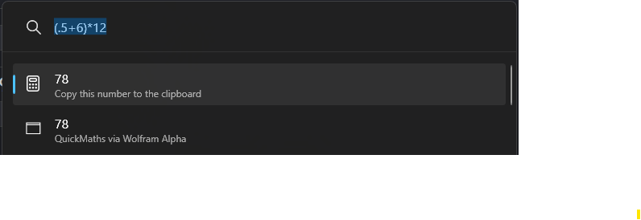
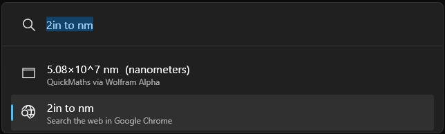
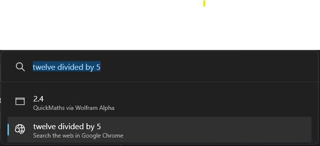
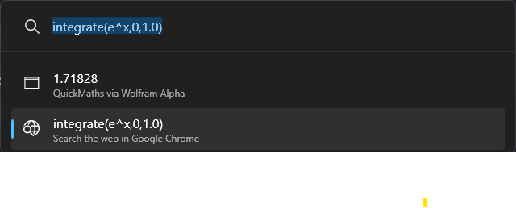
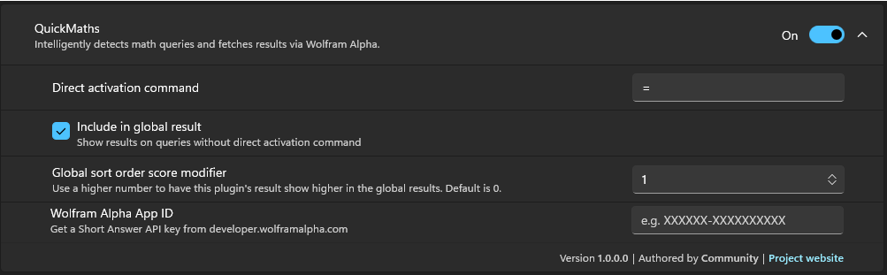
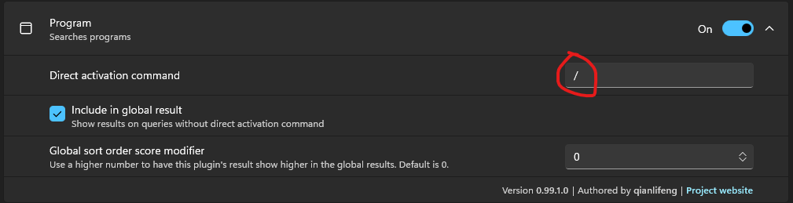

# QuickMaths — PowerToys Run Plugin

A [PowerToys Run](https://learn.microsoft.com/en-us/windows/powertoys/run) plugin that detects math queries and returns instant answers powered by the [Wolfram Alpha Short Answers API](https://products.wolframalpha.com/short-answers-api/documentation/).

> **AI-generated project.** This plugin was built with the assistance of an LLM (Claude by Anthropic). It is provided as-is under the MIT License with **zero warranty and no expectations of correctness, fitness for purpose, or ongoing maintenance.** Use at your own risk.

---

## Features

- **Global mode** — works alongside any search without a keyword; automatically filters out non-math queries before hitting the API.
- **Keyword mode** — type `=` followed by any expression to force a Wolfram Alpha lookup, bypassing the math detector.
- **Clipboard copy** — selecting a result copies it to the clipboard.
- **Delay-based querying** — only fires after you stop typing, avoiding unnecessary API calls mid-expression.

---

## Requirements

| Requirement | Version |
|---|---|
| Windows | 10 / 11 |
| PowerToys | 0.85 or later |
| .NET | 8.0 (included with PowerToys) |
| Wolfram Alpha App ID | Free tier available |

---

## Getting a Wolfram Alpha App ID

1. Go to [developer.wolframalpha.com](https://developer.wolframalpha.com) and sign in or create a free account.
2. Create a new app and select the **Short Answers API**.
3. Copy the App ID — it looks like `XXXXXX-XXXXXXXXXX`.

The free tier allows up to 2,000 API calls per month.

---

## Installation

### Option A — Deploy script (recommended)

1. Clone or download this repository.
2. Open PowerShell in the repository root and run:

   ```powershell
   .\deploy.ps1
   ```

   The script will:
   - Build the plugin in Release mode
   - Stop PowerToys (so the DLL is not locked)
   - Copy the plugin files to `%LocalAppData%\Microsoft\PowerToys\PowerToys Run\Plugins\QuickMaths\`
   - Restart PowerToys

3. Open PowerToys Settings → PowerToys Run → QuickMaths and paste your Wolfram Alpha App ID.

### Option B — Manual installation

1. Build the plugin in Release mode:

   ```powershell
   dotnet build Community.PowerToys.Run.Plugin.QuickMaths\Community.PowerToys.Run.Plugin.QuickMaths.csproj -c Release -p:Platform=x64
   ```

2. Close PowerToys completely (check the system tray).

3. Create the plugin folder if it does not exist:

   ```
   %LocalAppData%\Microsoft\PowerToys\PowerToys Run\Plugins\QuickMaths\
   ```

4. Copy everything from `Community.PowerToys.Run.Plugin.QuickMaths\bin\x64\Release\net8.0-windows\` into that folder.

5. Also copy `plugin.json` and the `Images\` folder into the same destination.

6. Restart PowerToys.

7. Open PowerToys Settings → PowerToys Run → QuickMaths and paste your App ID.

---

## Usage

| Mode | How to invoke | Example |
|---|---|---|
| Keyword | Type `=` then your expression | `= integrate x^2` |
| Global | Just type anywhere in PowerToys Run | `sin(45) + cos(0)` |

**Tip:** If you only want the plugin to respond when you explicitly type `=`, disable *Include in global result* in the plugin settings.

### Examples

**Simple arithmetic**



**Unit conversion**



**Natural language math**



**Calculus**



---

## Configuration

Open **PowerToys Settings → PowerToys Run → QuickMaths** to configure the plugin.



| Setting | Description |
|---|---|
| **Direct activation command** | Keyword that forces a Wolfram lookup regardless of input (`=` by default). |
| **Include in global result** | When enabled, QuickMaths runs on every query and uses the math pre-filter to decide whether to call Wolfram. Disable this to only trigger via the `=` keyword. |
| **Global sort order score modifier** | Increase this to make QuickMaths results appear higher in the global result list. |
| **Wolfram Alpha App ID** | Your Short Answers API key from [developer.wolframalpha.com](https://developer.wolframalpha.com). |

### Recommended: change the Program plugin's activation command

By default the **Program** plugin uses `.` as its direct activation command. This conflicts with leading-decimal queries like `.5+2` — PowerToys Run intercepts the `.` and routes the input to the Program plugin before QuickMaths can see it.

**It is recommended to change the Program plugin's activation command to something else (e.g. `/`).**

Open **PowerToys Settings → PowerToys Run → Program** and set *Direct activation command* to `your prefered keyword`:




---

## How it works

1. **MathDetector** applies a lightweight regex pre-filter in global mode — any query containing a digit, math operator (`+ - * / ^ % =`), or keyword (`sin`, `cos`, `sqrt`, `pi`, etc.) is forwarded to Wolfram Alpha. Everything else is ignored.
2. **WolframClient** calls the Wolfram Alpha Short Answers API and returns the plain-text result.
3. The result is shown as a single PowerToys Run result. Selecting it copies the answer to the clipboard.

---

## Building from source

```powershell
# Restore and build (Debug)
dotnet build

# Run tests
dotnet test QuickMaths.Tests\QuickMaths.Tests.csproj

# Build Release
dotnet build Community.PowerToys.Run.Plugin.QuickMaths\Community.PowerToys.Run.Plugin.QuickMaths.csproj -c Release -p:Platform=x64
```

Requires the [.NET 8 SDK](https://dotnet.microsoft.com/download/dotnet/8.0).

---

## Logs

The plugin writes a daily log file to:

```
%LocalAppData%\Microsoft\PowerToys\PowerToys Run\Logs\QuickMaths\YYYY-MM-DD.txt
```

Check this file first if something is not working.

---

## License

```
MIT License

Copyright (c) 2026 Community

Permission is hereby granted, free of charge, to any person obtaining a copy
of this software and associated documentation files (the "Software"), to deal
in the Software without restriction, including without limitation the rights
to use, copy, modify, merge, publish, distribute, sublicense, and/or sell
copies of the Software, and to permit persons to whom the Software is
furnished to do so, subject to the following conditions:

The above copyright notice and this permission notice shall be included in all
copies or substantial portions of the Software.

THE SOFTWARE IS PROVIDED "AS IS", WITHOUT WARRANTY OF ANY KIND, EXPRESS OR
IMPLIED, INCLUDING BUT NOT LIMITED TO THE WARRANTIES OF MERCHANTABILITY,
FITNESS FOR A PARTICULAR PURPOSE AND NONINFRINGEMENT. IN NO EVENT SHALL THE
AUTHORS OR COPYRIGHT HOLDERS BE LIABLE FOR ANY CLAIM, DAMAGES OR OTHER
LIABILITY, WHETHER IN AN ACTION OF CONTRACT, TORT OR OTHERWISE, ARISING FROM,
OUT OF OR IN CONNECTION WITH THE SOFTWARE OR THE USE OR OTHER DEALINGS IN THE
SOFTWARE.
```

---

## Disclaimer

This project was generated with the assistance of an AI language model and is released purely as a community experiment. It comes with **no warranty, no support, and no guarantee of accuracy**. Wolfram Alpha results are provided by a third-party service subject to their own terms of use. The authors accept no responsibility for incorrect answers or any consequences of relying on them.
